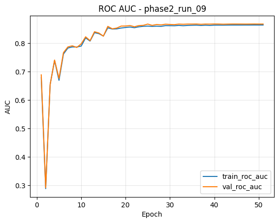
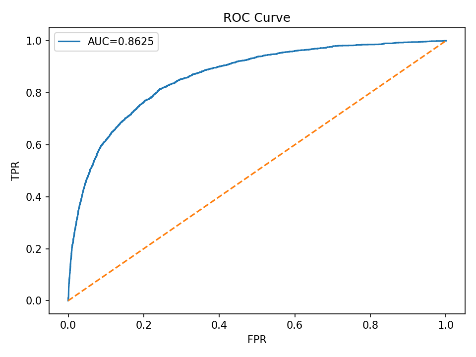

# 🏦 Credit-MLP: Evaluador de Riesgo Crediticio

**Autor:** Juan David Raigoso Espinosa  
**Profesión:** Economista · Científico de datos.   
**EMAIL:** Juan23@javerianacali.edu.co 

---

## 🌍 Contexto del proyecto

El presente proyecto tuvo como objetivo construir un modelo predictivo de riesgo crediticio, capaz de estimar la probabilidad de que un cliente incurra en morosidad de más de 90 días en sus obligaciones financieras.

El enfoque se centra en utilizar técnicas de aprendizaje profundo, específicamente un Perceptrón Multicapa (MLP, por sus siglas en inglés), implementado con PyTorch y gestionado con MLflow para trazabilidad, registro y comparación de experimentos.

La aplicación final permite realizar inferencias mediante una interfaz web desarrollada en Streamlit, donde el usuario puede ingresar datos manualmente o cargar un archivo CSV para obtener la probabilidad de incumplimiento.

---

## 📊 Fuente y descripción de los datos

- **Origen de los datos:** *🔗 https://www.kaggle.com/datasets/c/GiveMeSomeCredit*  
- **Cantidad de registros:** 150.000  
- **Variables originales::** 11
  - `SeriousDlqin2yrs`: Indicador de morosidad a 2 años
  - `RevolvingUtilizationOfUnsecuredLines`: Ratio de utilización de líneas de crédito no aseguradas  
  - `age`: Edad del cliente
  - `NumberOfTime30-59DaysPastDueNotWorse`: Nº veces 30-59 días en mora 
  - `DebtRatio`: Razón de deuda mensual sobre ingreso
  - `MonthlyIncome`: Ingreso mensual del cliente
  - `NumberOfOpenCreditLinesAndLoans`: Nº líneas o préstamos abiertos
  - `NumberOfTimes90DaysLate`: Nº veces con mora ≥ 90 días
  - `NumberRealEstateLoansOrLines`: Nº préstamos inmobiliarios o líneas
  - `NumberOfTime60-89DaysPastDueNotWorse`: Nº veces 60-89 días en mora
  - `NumberOfDependents`: Nº dependientes económicos
  - `Sex_num`: Sexo del solicitante

> Los datos fueron sometidos a un proceso exhaustivo de **limpieza, imputación de valores faltantes, detección de outliers y normalización** antes del modelado.

---

## 🧹 Preprocesamiento y preparación de datos

1. En MonthlyIncome y NumberOfDependents se imputaron valores faltantes con la mediana, debido a su resistencia frente a outliers.

2. Creación de variables:
   Se generó Sex_num a partir de la variable categórica Sex (codificación binaria).
   
3. Tratamiento de outliers:
   Se aplicó winsorización al 1% y 99% de las columnas más sesgadas:
     - RevolvingUtilizationOfUnsecuredLines
     - DebtRatio
     - MonthlyIncome
     - NumberOfTime30-59DaysPastDueNotWorse
     - NumberOfTime60-89DaysPastDueNotWorse
     - NumberOfTimes90DaysLate

4. Transformación logarítmica:
  Se aplicó log1p() para reducir asimetrías en MonthlyIncome, DebtRatio y RevolvingUtilizationOfUnsecuredLines.

5. Estandarización:

   Se utilizó StandardScaler de Scikit-learn ajustado sobre el conjunto de entrenamiento (fit_transform → transform).

6. División de Datos:
    - Train: 80%
    - Validation: 20%
    - División estratificada según la variable SeriousDlqin2yrs para conservar la proporción de clases.

---

## 🧠 Modelado

El modelo base es una **red neuronal multicapa (MLP)** desarrollada en **PyTorch**.

**Arquitectura general:**
- Capas ocultas: 3
- Función de activación: ReLU
- Regularización: Dropout y Weight Decay
- Optimización: Adam

---

## ⚙️ Modelo ganador

- **Optimización:** Adam  
- **hidden_layers**: [256, 128, 64].
- **Activation**: ReLU
- **dropout**: 0.50
- **batch_norm**: false,
- **Optimizer**: "adam",
- **lr**: 1e-1,
- **Weight_decay**: 5e-4,
- **Batch_size**: 24,
- **Epochs**: 80,
- **Early_stopping_patience**: 15

**Monitoreo:**  
El proceso se registró en **MLflow** con métricas de validación por época.

---

---
## 🧐 Justificación de Hiperparámetros.

| **Parámetro** | **Justificación** |
|----------------|-------------------|
| `hidden_layers` | Permite modelar relaciones no lineales complejas; se probó una estructura profunda de 3 capas decrecientes. |
| `activation=ReLU` | Introduce no linealidad y evita el problema del gradiente desvanecido. |
| `dropout=0.5` | Reduce el sobreajuste apagando neuronas aleatoriamente durante el entrenamiento. |
| `batch_norm=False` | Se omitió tras observar estabilidad suficiente sin normalización intermedia. |
| `optimizer=Adam` | Combina ventajas de AdaGrad y RMSProp; buen rendimiento en redes densas. |
| `lr=0.1` | Valor alto pero estabilizado por *scheduler* y regularización; aceleró la convergencia. |
| `weight_decay=5e-4` | Regularización L2 que penaliza pesos grandes, reduciendo sobreajuste. |
| `batch_size=24` | Tamaño pequeño que mejora la variabilidad de los gradientes. |
| `early_stopping_patience=15` | Evita sobreentrenar el modelo al monitorear la pérdida de validación. |

---

## 📈 Resultados y métricas

| Métrica | Valor |
|----------|-------|
| Accuracy | 0.8522 |
| Precision | 0.2640 |
| Recall | 0.6778 |
| F1-Score | 0.4350 |
| AUC-ROC | 0.8624 |

> Se seleccionó F1 Score como métrica principal porque el dataset es altamente desbalanceado (la clase positiva es minoritaria).

El F1 equilibra precisión y recall, permitiendo evaluar de forma justa la capacidad del modelo para detectar deudores sin penalizar falsos positivos en exceso.

---

## 📉 Curvas de entrenamiento

| **Loss** | **ROC-AUC** | **ROC Curve** |
|:---------:|:------------:|:--------------:|
|  |  |  |

> Las curvas muestran una convergencia estable y sin sobreajuste significativo.

---

## 💡 Umbral Operativo

Definido como el valor que maximiza el F1 Score en el conjunto de validación: threshold = 0.7827

Este umbral se utiliza para convertir las probabilidades en predicciones binarias en inferencia.

## 💡 Interpretación de resultados

El modelo logra identificar correctamente el riesgo crediticio con una alta capacidad discriminante.  
Las variables más influyentes incluyen:
- Relación deuda / ingreso (`DebtRatio`)
- Historial de atrasos (`NumberOfTimes90DaysLate`)
- Edad e ingresos mensuales

El umbral operativo definido fue **0.5**, clasificando como *riesgo* a los solicitantes con probabilidad ≥ 0.5.

---

## 🚀 Implementación

El modelo final (`best_phase2_run_09.pt`) se integra a una app **Streamlit** con dos módulos:

1. **Predicción individual** mediante formulario interactivo  
2. **Scoring por archivo (CSV)** con resultados en lote  

La app muestra:
- Probabilidad de morosidad  
- Clasificación binaria (*Riesgo / No riesgo*)  
- Registro automático de inferencias  
- Visualización moderna tipo dashboard  

> 💻 Accede a la demo: *(enlace de Streamlit Cloud, si lo publicas)*

---

## 🧾 Estructura del repositorio

---

## 🧑‍💻 Autor

**Juan David Raigoso Espinosa**  
🎓 Juan David Raigoso E. Cientifíco de Datos.
💼 Enfocado en Analítica de Datos, Machine Learning y Visualización (Power BI / Python)  
🔗 [LinkedIn](https://www.linkedin.com/in/juan-david-r-900824168/) | [GitHub](https://github.com/JuanRaigoso)

---

## 🏁 Conclusión

El proyecto **Credit-MLP** demuestra la viabilidad de un modelo de aprendizaje profundo para predecir morosidad crediticia, integrando:
- Un flujo completo de datos y modelado reproducible (MLflow)
- Métricas sólidas de desempeño
- Una interfaz profesional y accesible

> Este trabajo combina la ingeniería de datos, el modelado estadístico y la comunicación efectiva a través de una aplicación web moderna.

---

## ⚙️ Tecnologías utilizadas

| Categoría | Herramientas |
|------------|---------------|
| Lenguaje | Python 3.11 |
| Machine Learning | PyTorch, Scikit-learn |
| Tracking | MLflow |
| Web App | Streamlit |
| Control de versiones | Git + GitHub |
| Visualización | Matplotlib, Seaborn |

---

## 📬 Contacto

Si deseas conocer más sobre este proyecto o discutir colaboraciones:

📧 **juanraigosoespinosa@gmail.com**  
🔗 [LinkedIn](https://www.linkedin.com/in/juanraigoso)

---

